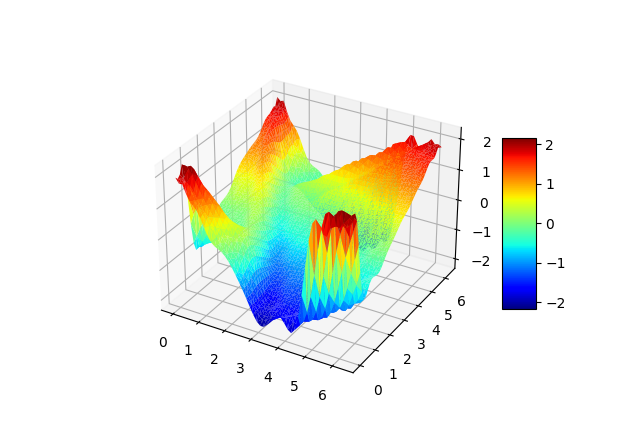

# GWRM - Generalized Weighted Residual Method

## Examples

### 2D Burgers
t = 1.0, (Nx = Ny = 1, K = L = 22, M = 5) \
 

### 2D Ideal MHD

## Install development tools 
Ubuntu
1. ```
   bash sudo apt-get update 
   ```
2. ```bash
   sudo apt-get install build-essential
   ```
3. ```bash
   sudo apt-get install gfortran
   ```

Windows
1. Install MinGW
2. Install compilers (c++, python, fortran)
3. To use make in PowerShell (mingw32-make.exe or make.exe)
   ```bash
   new-item alias:make -value 'C:\Program Files (x86)\GnuWin32\bin\make.exe.exe'
   ```

## Install Eigen
1. Download and extract Eigen (e.g. Linux - /usr/local/include)
2. Link to Eigen folder in Makefile (EIG_DIR = /usr/local/include/eigen-3.4.0/)

## Post-processing
```bash
python -m pip install -U pip
python -m pip install -U matplotlib
```
